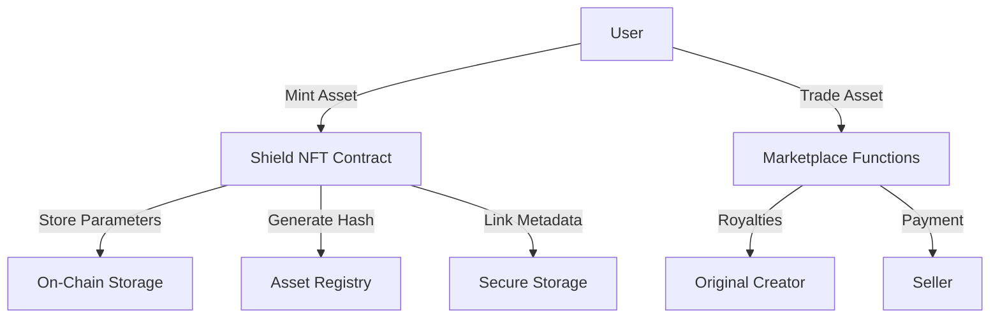

# Protect Shield: Digital Asset Security Platform

A comprehensive blockchain solution for secure digital asset generation, protection, and trading on the Stacks blockchain. The platform provides a robust framework for creating unique, verifiable digital assets with advanced security and ownership management features.

## Overview

Protect Shield empowers users to:
- Generate secure, unique digital assets
- Mint tokens with verifiable on-chain attributes
- Trade assets with built-in security mechanisms
- Ensure asset provenance and authenticity

The system leverages blockchain technology to store critical asset parameters on-chain, maintaining a transparent and immutable record of asset creation and ownership.

## Architecture

The smart contract system is built around a core NFT contract implementing advanced security and trading functionalities.



## Contract Documentation

### Shield NFT Contract

The main contract handling asset generation, security, and marketplace operations.

#### Key Features
- Secure asset parameter verification
- Automated royalty distribution
- Advanced marketplace functionality
- Cryptographic uniqueness validation

#### Access Control
- Minting: Controlled access with security checks
- Trading: Strict ownership verification
- Administrative functions: Multi-tier permissions

## Getting Started

### Prerequisites
- Clarinet
- Stacks wallet
- STX tokens for minting and trading

### Basic Usage

1. Mint a new Shield Asset:
```clarity
(contract-call? .shield-nft mint-shield-asset
    u12345                     ;; unique seed
    "digital-art"             ;; asset-type
    u100                      ;; scale/size
    u100                      ;; complexity
    "primary-category"        ;; primary attribute
    "secondary-attribute"     ;; secondary attribute
    "classification"          ;; classification
    "https://asset-metadata.uri" ;; metadata URI
)
```

2. List an Asset for Sale:
```clarity
(contract-call? .shield-nft list-for-sale
    u1              ;; asset-id
    u100000000      ;; price (in STX)
    u1000           ;; expiry block height
)
```

## Function Reference

### Minting Functions

```clarity
(mint-shield-asset 
    (seed uint)
    (asset-type (string-utf8 20))
    (scale uint)
    (complexity uint)
    (primary-attr (string-utf8 20))
    (secondary-attr (string-utf8 20))
    (classification (string-utf8 20))
    (metadata-uri (string-ascii 256)))
```

### Trading Functions

```clarity
(list-for-sale (asset-id uint) (price uint) (expiry uint))
(purchase (asset-id uint))
(cancel-listing (asset-id uint))
(transfer (asset-id uint) (sender principal) (recipient principal))
```

### Query Functions

```clarity
(get-owner (asset-id uint))
(get-asset-uri (asset-id uint))
(get-asset-parameters (asset-id uint))
(get-listing (asset-id uint))
(asset-exists (seed uint) ...)
```

## Development

### Testing
```bash
clarinet test
clarinet check
```

### Local Development
1. Clone the repository
2. Install Clarinet
3. Run `clarinet console`

## Security Considerations

### Known Limitations
- Asset uniqueness based on parameter verification
- Metadata URI integrity checks
- Listing expiry mechanism

### Best Practices
- Validate asset uniqueness pre-minting
- Verify listing validity
- Confirm ownership before transactions
- Use secure, immutable metadata storage

### Royalty Structure
- Dynamic royalty mechanism
- Configurable rates (default: 5%)
- Automatic creator compensation
- Royalty rate cap at 30%